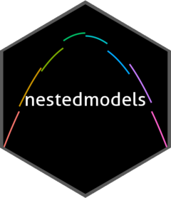

<!-- README.md is generated from README.Rmd. Please edit that file -->

# nestedmodels 

<!-- badges: start -->

[](https://www.repostatus.org/#active)
[](https://github.com/ashbythorpe/nestedmodels/actions/workflows/R-CMD-check.yaml)
[](https://CRAN.R-project.org/package=nestedmodels)
[](https://app.codecov.io/gh/ashbythorpe/nestedmodels?branch=master)
<!-- badges: end -->

The goal of nestedmodels is to allow the modelling of nested data. Some
models only accept certain predictors. For panel data, it is often
desirable to create a model for each panel. nestedmodels enhances the
‘[tidymodels](https://www.tidymodels.org/)’ set of packages by allowing
the user to classify a model as ‘nested’.

## Installation

``` r
# Install the released version on CRAN
install.packages("nestedmodels")

# Or install the development version from GitHub:
# install.packages("devtools")
devtools::install_github("ashbythorpe/nestedmodels")
```

## Example

``` r
library(nestedmodels)
```

Nested models are often best used on panel data.

``` r
data <- example_nested_data

nested_data <- tidyr::nest(example_nested_data, data = -id)

nested_data
#> # A tibble: 20 × 2
#>       id data             
#>    <int> <list>           
#>  1     1 <tibble [50 × 6]>
#>  2     2 <tibble [50 × 6]>
#>  3     3 <tibble [50 × 6]>
#>  4     4 <tibble [50 × 6]>
#>  5     5 <tibble [50 × 6]>
#>  6     6 <tibble [50 × 6]>
#>  7     7 <tibble [50 × 6]>
#>  8     8 <tibble [50 × 6]>
#>  9     9 <tibble [50 × 6]>
#> 10    10 <tibble [50 × 6]>
#> 11    11 <tibble [50 × 6]>
#> 12    12 <tibble [50 × 6]>
#> 13    13 <tibble [50 × 6]>
#> 14    14 <tibble [50 × 6]>
#> 15    15 <tibble [50 × 6]>
#> 16    16 <tibble [50 × 6]>
#> 17    17 <tibble [50 × 6]>
#> 18    18 <tibble [50 × 6]>
#> 19    19 <tibble [50 × 6]>
#> 20    20 <tibble [50 × 6]>
```

The `nested_resamples()` function makes sure that the testing and
training data contain every unique value of ‘id’.

``` r
split <- nested_resamples(nested_data, rsample::initial_split())

data_tr <- rsample::training(split)
data_tst <- rsample::testing(split)
```

Fitting a nested model to this data is very simple.

``` r
model <- parsnip::linear_reg() %>%
  nested()

fit <- fit(model, z ~ x + y + a + b, 
           tidyr::nest(data_tr, data = -id))

predict(fit, data_tst)
#> # A tibble: 260 × 1
#>    .pred
#>    <dbl>
#>  1  29.3
#>  2  14.9
#>  3  17.9
#>  4  51.5
#>  5  36.4
#>  6  42.4
#>  7  38.3
#>  8  20.2
#>  9  46.0
#> 10  38.7
#> # … with 250 more rows
```

If you don’t want to nest your data manually, use `step_nest()` inside a
workflow:

``` r
recipe <- recipes::recipe(data_tr, z ~ x + y + a + b + id) %>%
  step_nest(id)

wf <- workflows::workflow() %>%
  workflows::add_model(model) %>%
  workflows::add_recipe(recipe)

wf_fit <- fit(wf, data_tr)

predict(wf_fit, data_tst)
#> # A tibble: 260 × 1
#>    .pred
#>    <dbl>
#>  1  29.3
#>  2  14.9
#>  3  17.9
#>  4  51.5
#>  5  36.4
#>  6  42.4
#>  7  38.3
#>  8  20.2
#>  9  46.0
#> 10  38.7
#> # … with 250 more rows
```

Please note that the nestedmodels project is released with a
[Contributor Code of
Conduct](https://ashbythorpe.github.io/nestedmodels/CODE_OF_CONDUCT.html).
By contributing to this project, you agree to abide by its terms.
